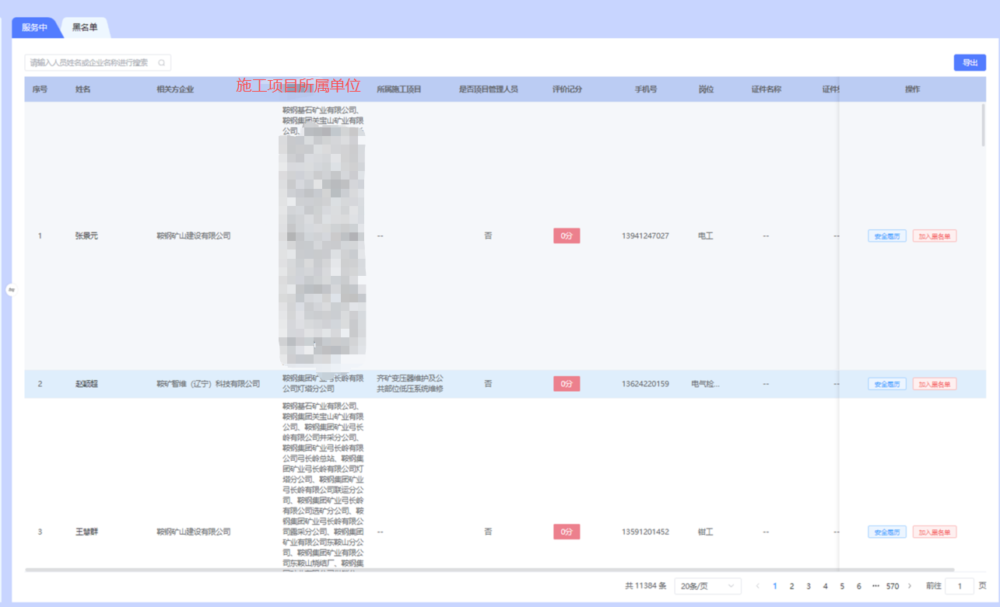

算力生命周期架构方案
一、核心逻辑:
①作业场景驱动算法 → 算法驱动任务 → 任务驱动算力 → 算力自动调度摄像头 → AI识别结果闭环优化
②强调：硬件：放在智盒不参与任务策略。按照规则实时监测高风险和重点部位区域。只有中心算力服务器才下发算力和算法。

二、算力架构
1、高危点位：边缘防灾智盒实时分析
2、普通区域：中心AI算力轮巡分析
3、中心集群：统一调度实时告警复核、轮巡、倒查、样本处理任务

三、中心算力需要支持：
1、任务优先级抢占
2、资源池化调度
3、时间片轮巡
4、忙闲弹性调度

四、智能算力管控
├── 算力总览：当前有多少算力，有多少摄像头正在分析，有多少任务运行，资源是否健康。            
├── 算力资源管理:“有什么算力”类似服务器资源池。
├── 算法模型管理：“有什么算法”  这个删除。在智能运维已有
├── 智能任务调度：系统自动生成任务，任务执行情况
├── 场景算法策略：场景类型（作业/重点部位/高风险区域） → 算法策略
├── 摄像头算法配置：
└── 算力运行监控：

五、业务流程
作业计划创建
↓
识别作业类型
↓
匹配作业区域
↓
找到绑定摄像头
↓
加载算法策略
↓
生成AI任务
↓
计算事件等级
↓
分配算力
↓
执行分析
↓
产生报警
↓
样本回流优化算法

六、特殊场景处理方案：
1、不同任务：调度同一个摄像头策略
①按照事件级别：优先执行等级高的算力和算法策略。等级高的任务执行结束后，则执行下一个等级策略。无任务时，则执行空闲轮询全局任务的策略
②交叉作业情况：多个场景同步情况。则取合集算法和场景中高算力的策略
2、AI防灾智盒发现了违章和隐患，则直接同摄像头融合一起。展示边缘的AI方式
无防灾智盒的，直接流媒体分流给gpu算力进行轮询和策略进行计算

七、字典：
事件等级：
P0 实时告警(智盒+移动布控)
P1 普通区域轮巡
P2 事后视频倒查
P3 样本&大模型迭代
当前时段：白天08:00-18:00，P3自动限流退让

算法：
算法名称、算法编码、算法类型（行为识别、环境、设备等）、分析模型（人，物、车等）、算法处置方式（违章、隐患、事故）

违章规则：违章类型、违章等级、违章规则