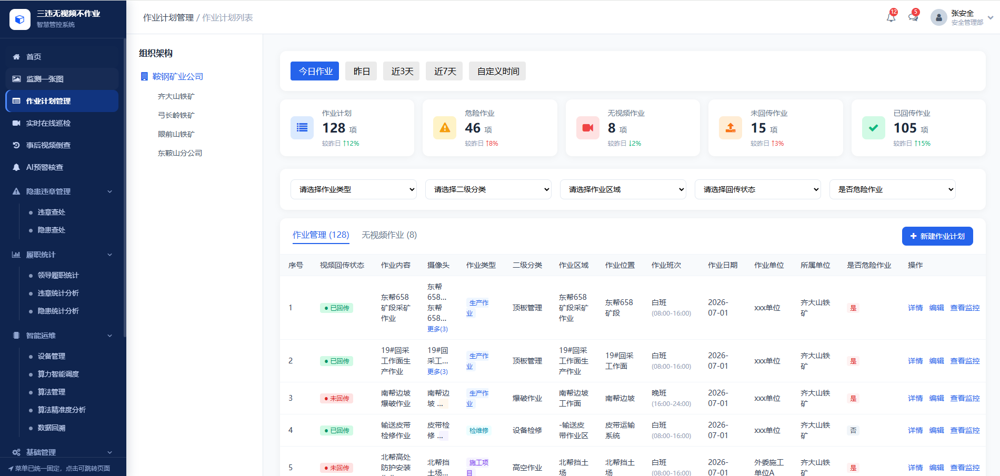

说在前面：
1、数据权限
1）组织架构中，默认按照登录账号显示组织架构数。展示本级及下级；若是最末级的单位，则组织架构不显示。
2）内容区域数据则按照选择组织架构树的单位，显示本级和下级所有单位数据，依据所属单位字段查询。
3）所有菜单和按钮，都支持角色可配置。
2、交互说明：
1）所有页面中，若包含组织架构树，则支持收起和展开。

第一部分：作业计划管理
【功能页面】

【功能说明】
1、日期快捷选择
默认选择今日作业；按照作业日期字段筛选；

2、统计卡片
1）作业计划：统计作业管理tab下的所有数据的数量；较昨日：(今日作业总数 − 昨日作业总数) ÷ 昨日作业总数 × 100%
2）危险作业：统计作业管理tab下的所有数据中“是否危险作业”值为是的数量；较昨日：(今日危险作业总数 − 昨日危险作业总数) ÷ 昨日危险作业总数 × 100%
3）无视频作业：统筛选时间范围内，无视频作业tab下的数量。较昨日：规则公式同上
4）未回传作业：统计作业管理tab下的所有数据中“视频回传状态”值为已回传的数量；较昨日：规则公式同上
5）已回传作业：统计作业管理tab下的所有数据中“视频回传状态”值为未回传的数量；较昨日：规则公式同上

3、列表数据
*列表排序：按照创建时间倒序；
1）规则说明：所有从第三方同步过来的数据以及在实时在线巡检视频自动通过有人监测算法识别到有人超过5分钟一直有人，则摄像头识别到的数据，自动进入到无视频作业tab中。
关于从第三方同步过来的规则：
①从安全作业管理系统中，同步过来的数据；【暂时不做同步，因危险作业尚未迭代完成】
②从一件一案同步过来的数据，按照以下字段对应关系
  一件一案字段 ---  无视频不作业字段
      项目名称 --- 作业内容
      业主单位 --- 所属单位
      施工或检维修单位名称  --- 作业单位
      计划周期（若周期是跨天的） --- 自动从一件一案中一天一天的同步过来数据。（如：一件一案作业周期是3.1-3.3，3.1日获取该数据一次，3.2一次，3.3一次）
      作业地点 --- 作业位置
      剩余其他信息无法同步：则空，需完善补充。
③在无视频作业tab中，若完善了必要字段信息（除了备注字段，其他都是必填，包括标注点位），则自动进入到作业计划tab中。若点击了忽略，则再次确认忽略后，则直接删除。

2）必要的字段说明：
①全局字段：列表数据支持3行展示，超过则缺省...显示，鼠标移入则tips气泡显示全部文案。
(⊙﹏⊙)视频回传状态：若是固定摄像头类的，待作业完成后，则自动从NVR录像机中自动获取当前作业周期时间范围内的视频数据，与之作业计划关联绑定。当点击倒查时，则进入倒查页面中，视频开始和结束时间也只是作业计划周期内视频数据。获取成功后作业计划，则状态变更为“已回传”。若是其他设备，无自动至NVR中的，则可支持手动上传视频，上传的视频最大不超过10G，手动上传类的，则倒查时，则直接按照上传的视频数据播放即可。
②摄像头：一个摄像头一行，做多显示2行，超过则第3行显示更多(n),点击更多，则tip显示全部摄像头。
③作业日期：仅显示一个日期。比如2026-07-01.不支持2026-07-01-2026-07-03这种。一个日期一个作业计划。
④点击查看监控：则跳转至【实时在线巡检】页面的作业计划tab页面。左侧的作业列表中，选中当前作业，并且视频窗口区域，仅显示当前作业关联的视频。
⑤点击倒查，则跳转至【视频视频倒查-查看回放】页面。作业计划列表选中跳转过来传递过来的作业数据。

3）新增作业计划：

必要字段说明：
①所属单位，在点击新增作业计划按钮时，则根据点击左侧架构数选中的单位，作为默认所属单位字段的值，支持编辑。若登录账号是末级单位，则所属单位字段默认就是该单位，不可修改。
②作业类型和二级分类：值来自【基础管理-作业类型管理】，两个字段为级联关系；
③作业区域：值来自【基础管理-作业区域管理】，下拉的值，按照当前所属单位值，加载作业区域一级、二级，对其选择（层级是一级的作业区域，默认从电子档案中获取当前单位的区域。也可以自行添加，因无电子档案，故此无法渲染在监控一张图上）。仅可选择树结构中的最未节点。
④作业位置，纯输入框400字符限制。
⑤去标注点位：若作业区域一层级别是从电子档案中获取来的。则有该按钮。如无，则无该按钮；如有，则点击后，跳转至【标注弹窗页面】

默认是当前作业区域的gis地图。楼栋则就是作业区域的层级一级的值，楼层则是作业区域层级二级的值。选择作业区域层级后，则楼栋楼层都是直接回显过来，不可修改。
*若只有楼栋的电子档案，无楼层的，则仅显示楼栋的gis图。楼层值显示“无楼层电子档案信息”即可。
⑥作业单位：可选择组织机构，组织内单位，也可以选择相关方单位（可选择所属单位及下级单位所关联的相关方企业），弹窗显示。

相关方单位，自动查出来所属单位下的所有相关方企业，弹窗中选择的组织架构树无关系。组织架构和相关方企业tab中，仅可选择其一。
⑦作业班次：值来自【作业班次】。
⑧作业人员：添加人员，点击后则跳弹窗。

⑨选择摄像头
默认从作业区域关联的摄像头中自动回显过来。支持二次编辑和调整。如删除和选择摄像头，重新选择。

第二部分：实时在线巡检
【功能页面】

【功能说明】
1、作业区域组织架构
①所属单位：登陆账号是：监管单位或有下级的业务单位时，则默认选择组织架构树中的第一个业务单位，可切换下级其他业务单位。若登录账号就是最末级业务单位，则显示自己所在单位，不可选择其他单位。
②作业区域架构树：按照选择的所属单位，显示当前所属单位的区域架构树。按照区域层级逐级显示，最终显示挂载的摄像头为止。
同区域下，摄像头优先排序根据关联的作业规则如下：
危险作业>非危险作业>无作业关联的。
->摄像头名称图标：需要显示固定摄像头、移动摄像头、执法仪的图标标识。鼠标移入图标则给与tips提示，显示内容是设备类型名称，如固定摄像头，移动摄像头，执法仪。
->在线/离线标识：图标和摄像头名称，离线都给置灰处理；
->关联作业：在摄像头名称下方，显示关联作业内容的值。固定长度，超过则缺省，鼠标移入tips显示全部。在作业内容后面增加，查看作业的文字链接，点击弹窗作业详情信息。

->选中某个摄像头名称时，则视频区域1宫格显示，当前选中摄像头的窗口。

2、作业计划列表
按照所属单位，根据作业所属单位字段，查询本级及下级所有作业（仅作业管理tab中的数据，不包括无视频作业tab下的）

3、视频栅格区域
①默认按照9宫格显示，有页码显示。
②视频左上角显示标签：若有关联作业：则显示作业二级分类标签名称（作业结束后，标签消除）。若无作业关联，但是检测到人员长时间停留，超过告警时间，则给到标签【人员长时间停留】的标签（处理后，标签清除后替换作业相关标签）。若发生预警：则预警持续时间内，额外追加预警的标签（未检测后，则标签去除）。
③点击某个视频窗口（窗口给到选中状态），则左边的摄像头tab架构或者作业计划的列表，则迅速定位到摄像头位置，并给与高亮显示。
④视频画面区域：若检测到违章行为或隐患行为，则直接在视频内容区域内，持续监测报警期间内，一直框出预警区域，在左上角给到预警类型名称。若未佩戴安全帽、人员倒地等。
⑤视频标题：上一级的区域的名称 - 摄像头名称 ，通过“-”符号，拼接而成。
⑥状态：在线/离线。
⑦全屏：点击后，全屏显示（非一宫格的方式，而是所有屏幕都是视频画面）。
⑧标记违章/隐患的操作按钮，鼠标移入给到tips提示“标记违章/隐患”提示语。
点击则跳转到标注视频页面

当前视频画面实时直播数据流的画面。
->可点击标注违章/隐患操作
点击后，则当前画面的直接拍照，回显在右侧的违章/隐患查处tab的照片区域。最多3张。也支持手动从电脑中选择照片。
->点击全屏放大，则全屏显示。
->违章/隐患查处tab下的必要字段说明：
   单据类型违章时：
   违章名称：下拉选择，值来自于【违章规则】；
   违章等级：根据违章名称自动回显；
   违章单位：当前违章作业单位，
   违章条款/依据：根据违章名称自动回显；
   违章人员：根据AI人脸识别，自动识别人员，并回显在这里。若识别不到，则手动选择。
   
   发现时间：点击标注违章/隐患的时间；
   作业位置：作业位置的值回显。
   单据类型隐患时：
   隐患描述：输入框，默认无值。支持400字符。
   隐患分类和隐患等级：来自基础管理的对应的字典值。
   ->我标注的：tab下的必要字段说明：
   表示我当前针对这个摄像头，这个作业期间我标注的违章/隐患信息。
   
   ⑨视频设置功能
   ->自定义轮播设置
   