说在前面：
1、数据权限
1）组织架构中，默认按照登录账号显示组织架构数。展示本级及下级；若是最末级的单位，则组织架构不显示。
2）内容区域数据则按照选择组织架构树的单位，显示本级和下级所有单位数据，依据所属单位字段查询。
3）所有菜单和按钮，都支持角色可配置。
2、交互说明：
1）所有页面中，若包含组织架构树，则支持收起和展开。
3、AI预警事件流程：
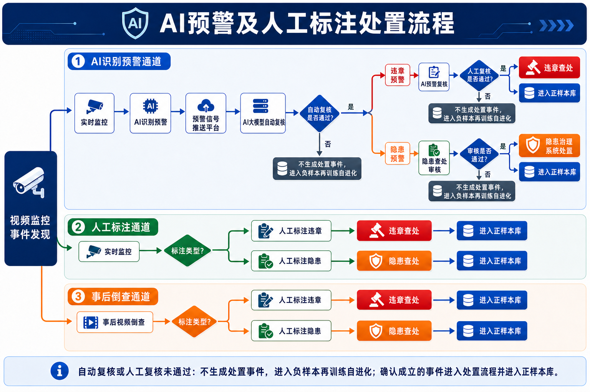
4、AI训练平台
1）进入正负样本则优先进入AI训练平台标注平台，标注成功后才会进入正负样本。非直接进入平台样本库。
2）提供算法精准度。每次训练版本之后，精准度的提升百分比。按单位，按全集团综合，可支持按周和按月，按季，按年查询提升百分比数值；
3）进入平台的数据种类包括：所有预警类的预警消息（包括AI大模型复核：审核通过和不通过的。AI预警复核：通过和不通过的；人工标注的、视频回传识别到的）
5、AI自动识别的场景
1）、识别人的算法：用于实时监控识别和视频回传后的视频识别。
2）、违章/隐患识别算法：用于实时监控识别和视频回传（包括手动上传的视频）后的视频识别。
5、关于去重的规则：
①同一个作业周期，同一个摄像头，同一个人（若能识别到人的话），同一个算法：在排重时间窗口内合并，不重复生成预警
②同一人员或隐患被同一个作业关联的其他摄像头连续识别：在跨摄像头关联窗口内合并
③同一画面多人同时违章：按人员分别生成预警
④同一人员同时存在不同违章：按事件类型分别生成预警；
⑤事件消失后再次出现：出现在违章/隐患查处核实审核之后，则生成新预警。
6、AI大模型复核的关键词：【腾讯文档】用千问过滤防灾智盒算法准确率复核提示词
https://docs.qq.com/doc/DS3B6U3BIZVZWV2Fr

第一部分：作业计划管理
【功能页面】
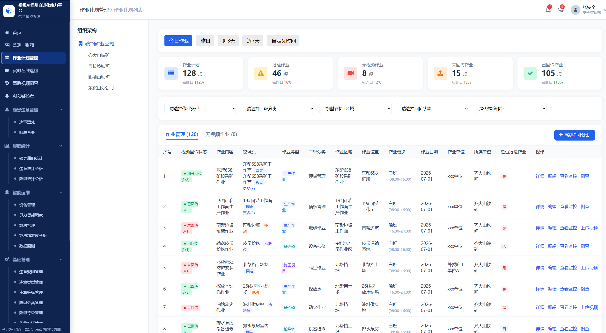
【功能说明】
1、日期快捷选择
默认选择今日作业；按照作业日期字段筛选；

2、统计卡片
1）作业计划：统计作业管理tab下的所有数据的数量；较昨日：(今日作业总数 − 昨日作业总数) ÷ 昨日作业总数 × 100%
2）危险作业：统计作业管理tab下的所有数据中“是否危险作业”值为是的数量；较昨日：(今日危险作业总数 − 昨日危险作业总数) ÷ 昨日危险作业总数 × 100%
3）无视频作业：统筛选时间范围内，无视频作业tab下的数量。较昨日：规则公式同上
4）未回传作业：统计作业管理tab下的所有数据中“视频回传状态”值为已回传的数量；较昨日：规则公式同上
5）已回传作业：统计作业管理tab下的所有数据中“视频回传状态”值为未回传的数量；较昨日：规则公式同上

3、列表数据
*列表排序：按照创建时间倒序；
1）规则说明：所有从第三方同步过来的数据以及在实时在线巡检视频自动通过有人监测算法识别到有人超过5分钟一直有人，则摄像头识别到的数据，自动进入到无视频作业tab中。
关于从第三方同步过来的规则：
①从安全作业管理系统中，同步过来的数据；【暂时不做同步，因危险作业尚未迭代完成】
②从一件一案同步过来的数据，按照以下字段对应关系
  一件一案字段 ---  无视频不作业字段
      项目名称 --- 作业内容
      业主单位 --- 所属单位
      施工或检维修单位名称  --- 作业单位
      计划周期（若周期是跨天的） --- 自动从一件一案中一天一天的同步过来数据。（如：一件一案作业周期是3.1-3.3，3.1日获取该数据一次，3.2一次，3.3一次）
      作业地点 --- 作业位置
      剩余其他信息无法同步：则空，需完善补充。
③在无视频作业tab中，若完善了必要字段信息（除了备注字段，其他都是必填，包括标注点位），则自动进入到作业计划tab中。若点击了忽略，则再次确认忽略后，则直接删除。

2）必要的字段说明：
①全局字段：列表数据支持3行展示，超过则缺省...显示，鼠标移入则tips气泡显示全部文案。
(⊙﹏⊙)视频回传状态：若是固定摄像头类的，待作业完成后，则自动从NVR录像机中自动获取当前作业周期时间范围内的视频数据，与之作业计划关联绑定。当点击倒查时，则进入倒查页面中，视频开始和结束时间也只是作业计划周期内视频数据。获取成功后作业计划，则状态变更为“已回传”。若是其他设备，无自动至NVR中的，则可支持手动上传视频，上传的视频最大不超过10G，手动上传类的，则倒查时，则直接按照上传的视频数据播放即可。
②摄像头：一个摄像头一行，做多显示3行，超过则第3行显示更多(n),点击更多，则tip显示全部摄像头。
③作业日期：仅显示一个日期。比如2026-07-01.不支持2026-07-01-2026-07-03这种。一个日期一个作业计划。
④点击查看监控：则跳转至【实时在线巡检】页面的作业计划tab页面。左侧的作业列表中，选中当前作业，并且视频窗口区域，仅显示当前作业关联的视频。
⑤点击倒查，则跳转至【视频视频倒查-查看回放】页面。作业计划列表选中跳转过来传递过来的作业数据。

3）新增作业计划：
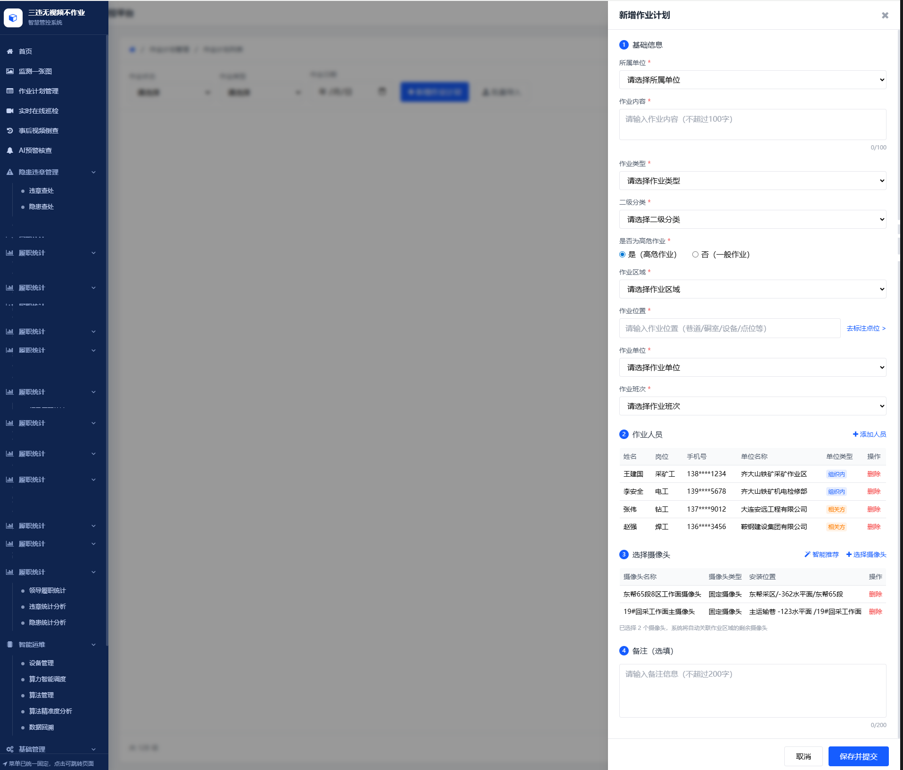
必要字段说明：
①所属单位，在点击新增作业计划按钮时，则根据点击左侧架构数选中的单位，作为默认所属单位字段的值，支持编辑。若登录账号是末级单位，则所属单位字段默认就是该单位，不可修改。
②作业类型和二级分类：值来自【基础管理-作业类型管理】，两个字段为级联关系；
③作业区域：值来自【基础管理-作业区域管理】，下拉的值，按照当前所属单位值，加载作业区域一级、二级，对其选择（层级是一级的作业区域，默认从电子档案中获取当前单位的区域。也可以自行添加，因无电子档案，故此无法渲染在监控一张图上）。仅可选择树结构中的最未节点。
④作业位置，纯输入框400字符限制。
⑤去标注点位：若作业区域选择是从电子档案中获取来的。则有该按钮。如无，则无该按钮；如有，则点击后，跳转至【标注弹窗页面】
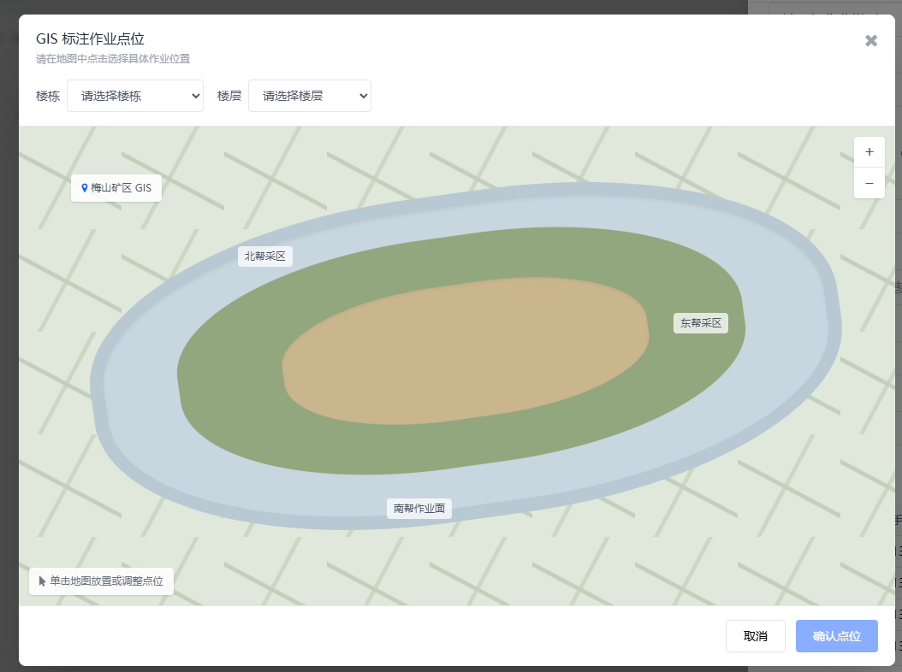
默认是当前作业区域的gis地图。楼栋则就是作业区域的层级一级的值，楼层则是作业区域层级二级的值。选择作业区域层级后，则楼栋楼层都是直接回显过来，不可修改。
*若只有楼栋的电子档案，无楼层的，则仅显示楼栋的gis图。楼层值显示“无楼层电子档案信息”即可。
⑥作业单位：可选择组织机构，组织内单位，也可以选择相关方单位（可选择所属单位及下级单位所关联的相关方企业），弹窗显示。
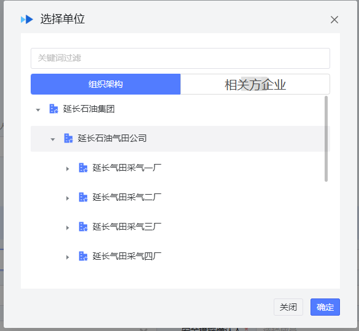
相关方单位，自动查出来所属单位下的所有相关方企业，弹窗中选择的组织架构树无关系。组织架构和相关方企业tab中，仅可选择其一。
⑦作业班次：值来自【作业班次】。
⑧作业人员：添加人员，点击后则跳弹窗。
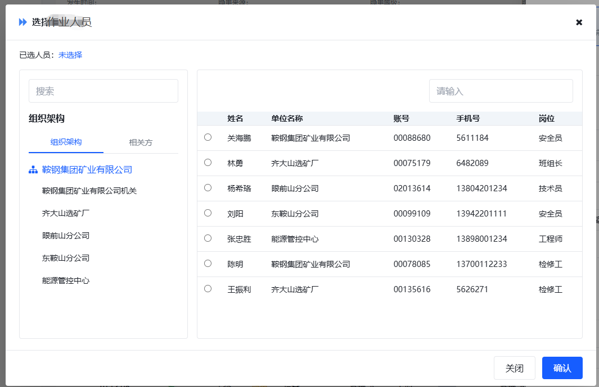
⑨选择摄像头
默认从作业区域关联的摄像头中自动回显过来。支持二次编辑和调整。如删除和选择摄像头，重新选择。
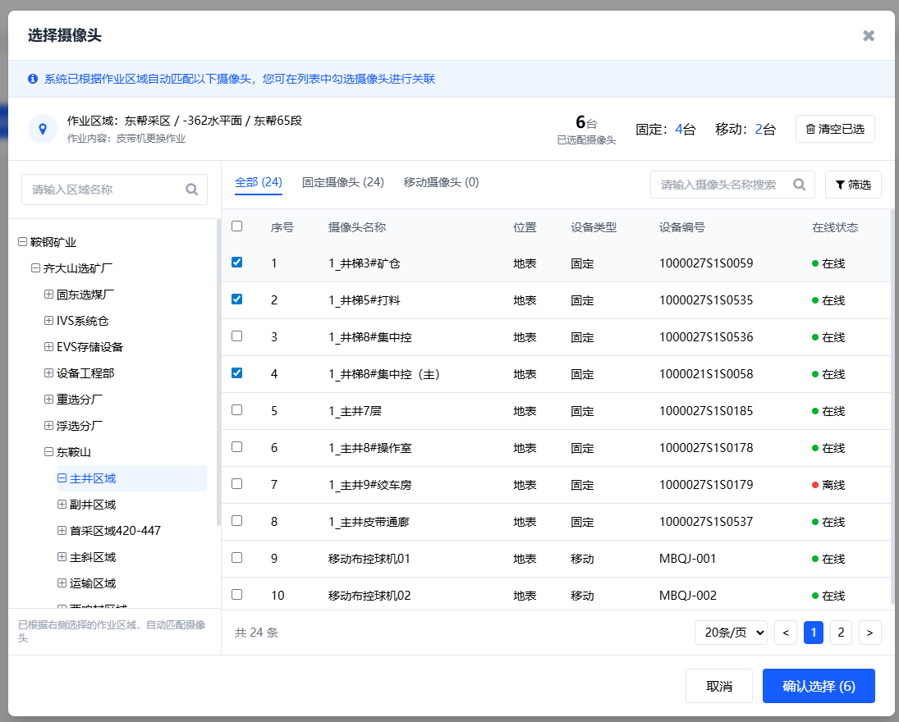

第二部分：实时在线巡检
【功能页面】
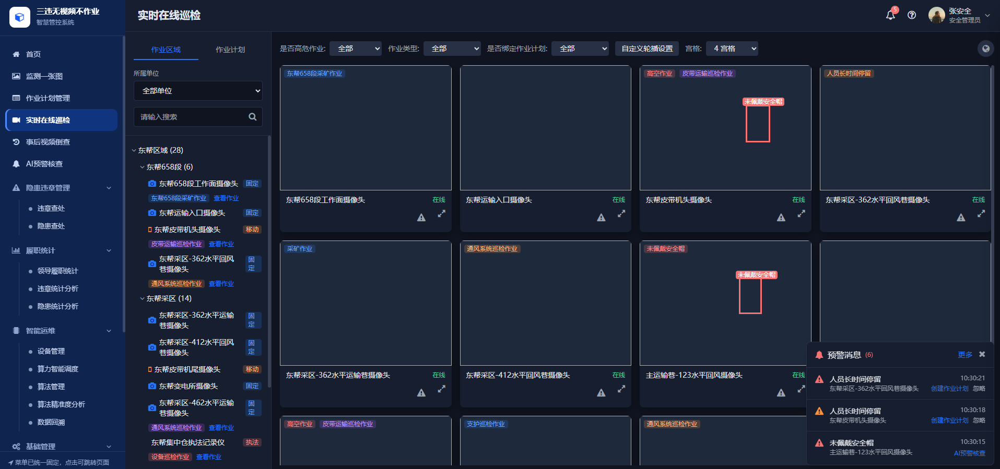
【功能说明】
1、作业区域组织架构
①所属单位：登陆账号是：监管单位或有下级的业务单位时，则默认选择组织架构树中的第一个业务单位，可切换下级其他业务单位。若登录账号就是最末级业务单位，则显示自己所在单位，不可选择其他单位。
②作业区域架构树：按照选择的所属单位，显示当前所属单位的区域架构树。按照区域层级逐级显示，最终显示挂载的摄像头为止。
同区域下，摄像头优先排序根据关联的作业规则如下：
危险作业>非危险作业>无作业关联的。
->摄像头名称图标：需要显示固定摄像头、移动摄像头、执法仪的图标标识。鼠标移入图标则给与tips提示，显示内容是设备类型名称，如固定摄像头，移动摄像头，执法仪。
->在线/离线标识：图标和摄像头名称，离线都给置灰处理；
->关联作业：在摄像头名称下方，显示关联作业内容的值。固定长度，超过则缺省，鼠标移入tips显示全部。在作业内容后面增加，查看作业的文字链接，点击弹窗作业详情信息。
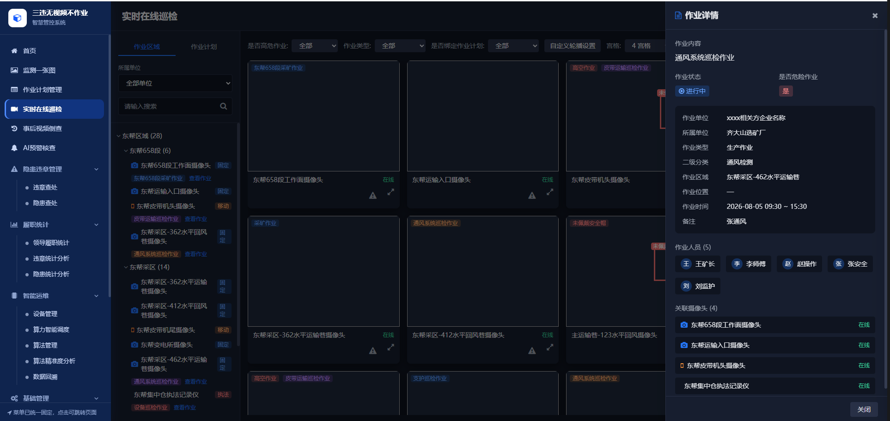
->选中某个摄像头名称时，则视频区域1宫格显示，当前选中摄像头的窗口。

2、作业计划列表
按照所属单位，根据作业所属单位字段，查询本级及下级所有作业（仅作业管理tab中的数据，不包括无视频作业tab下的）

3、视频栅格区域
①默认按照9宫格显示，有页码显示。
②视频左上角显示标签：若有关联作业：则显示作业二级分类标签名称（作业结束后，标签消除）。若无作业关联，但是检测到人员长时间停留，超过告警时间，则给到标签【人员长时间停留】的标签（处理后，标签清除后替换作业相关标签）。若发生预警：则预警持续时间内，额外追加预警的标签（未检测后，则标签去除）。
③点击某个视频窗口（窗口给到选中状态），则左边的摄像头tab架构或者作业计划的列表，则迅速定位到摄像头位置，并给与高亮显示。
④视频画面区域：若检测到违章行为或隐患行为，则直接在视频内容区域内，持续监测报警期间内，一直框出预警区域，在左上角给到预警类型名称。若未佩戴安全帽、人员倒地等。
⑤视频标题：上一级的区域的名称 - 摄像头名称 ，通过“-”符号，拼接而成。
⑥状态：在线/离线。
⑦全屏：点击后，全屏显示（非一宫格的方式，而是所有屏幕都是视频画面）。
⑧标记违章/隐患的操作按钮，鼠标移入给到tips提示“标记违章/隐患”提示语。
点击则跳转到标注视频页面
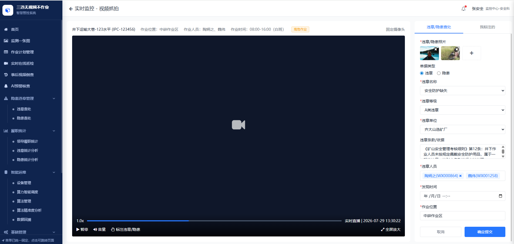
当前视频画面实时直播数据流的画面。
->可点击标注违章/隐患操作
点击后，则当前画面的直接拍照，回显在右侧的违章/隐患查处tab的照片区域。最多3张。也支持手动从电脑中选择照片。
->点击全屏放大，则全屏显示。
->违章/隐患查处tab下的必要字段说明：
   单据类型违章时：
   违章名称：下拉选择，值来自于【违章规则】；
   违章等级：根据违章名称自动回显；
   违章单位：当前违章作业单位，
   违章条款/依据：根据违章名称自动回显；
   违章人员：根据AI人脸识别，自动识别人员，并回显在这里。若识别不到，则手动选择。
   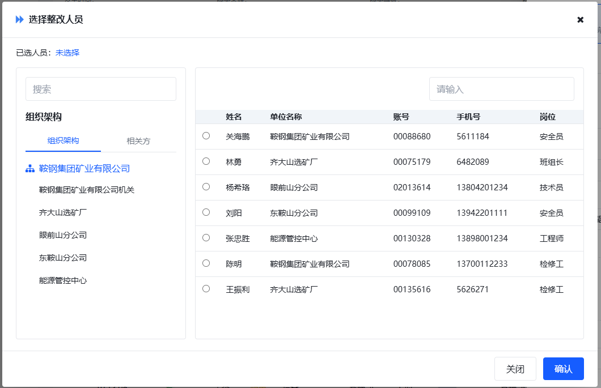
   发现时间：点击标注违章/隐患的时间；
   作业位置：作业位置的值回显。
   单据类型隐患时：
   隐患描述：输入框，默认无值。支持400字符。
   隐患分类和隐患等级：来自基础管理的对应的字典值。
   ->我标注的：tab下的必要字段说明：
   表示我当前针对这个摄像头，这个作业期间我标注的违章/隐患信息。
   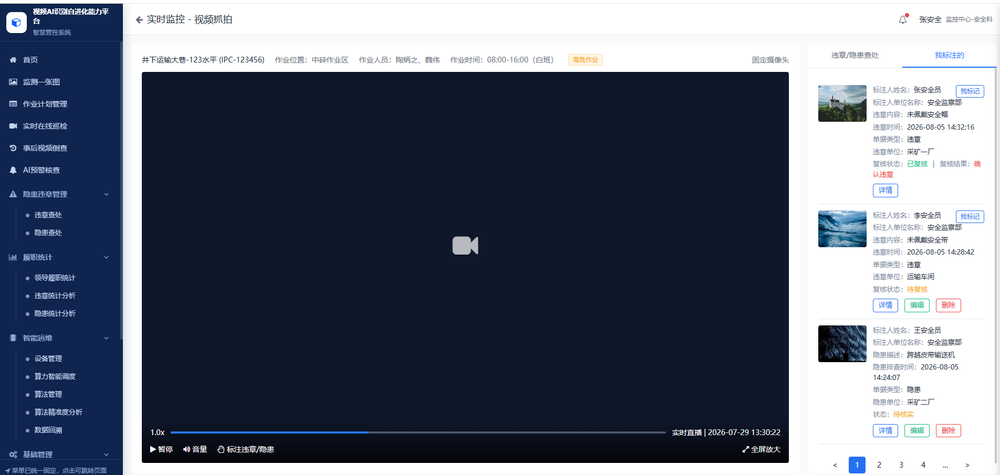
   ⑨视频设置功能
   ->自定义轮播设置
   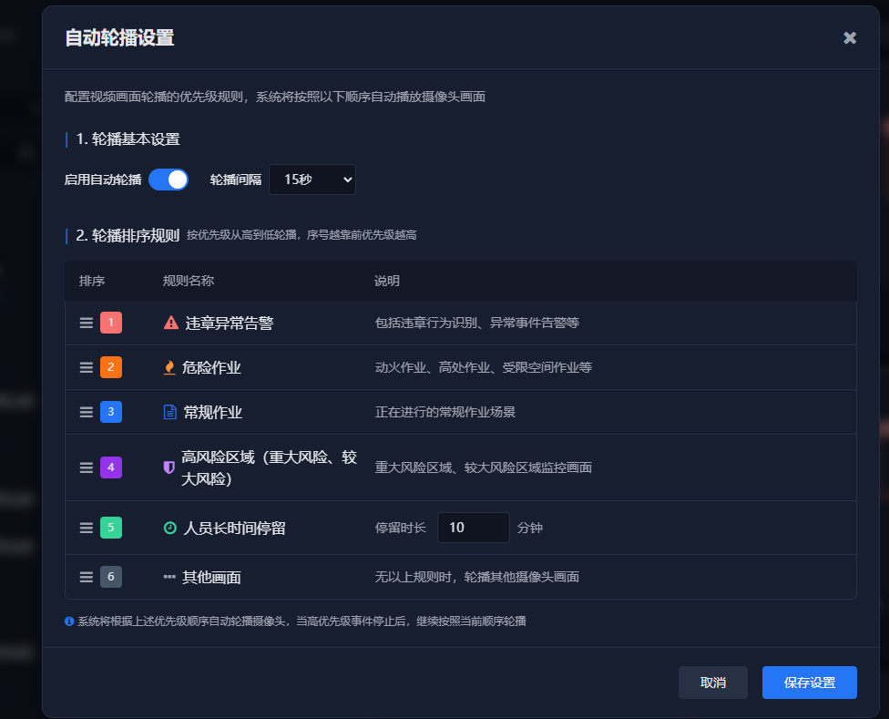
   该轮播规则是固定的，按照这六个轮播规则，来自动进行摄像头排序的规则。时刻监控视频的属性，顺序规则进行调整顺序。可按照定时任务进行监控排序。
   违章异常告警：则表示AI隐患识别到违章/隐患持续预警期间；
   危险作业：关联了作业且是危险作业的
   常规作业：关联了作业且是非危险作业的
   高风险区域：根据设想头选择的关联的区域，若未绑定作业，则按照区域风险等级判定。进队重大和较大风险区域进行排序规则；
   人员长时间停留：按照配置的时长规则，超过人员识别停留时长后，则视为满足该规则。
   其他画面：其他摄像头
   ->全屏展示：则表示对视频区域，直接全屏展示。用于在监控大屏上展示。
   ->gis地图入口：点击后跳转至监测一张图。按照登陆账号所在单位进行匹配进入，若是集团账号，则进入集团视角。业务单位进入业务单位视角。
   ->预警消息弹窗
   显示的是当天的预警消息。
   每次弹出一条消息，每条有表头，显示共计多少条和能点击更多按钮。
   预警消息：分为人员长时间停留和AI违章/隐患识别类。标题则预警是违章名称或AI识别的隐患描述名称。
   副标题：上一级作业区域名称 - 摄像头名称，拼接而成。
   忽略：点击则视为不再关注该预警信息，则后续1个小时内不在这个摄像头中，再报人员长时间停留的预警。同时等同于点击【作业计划管理-无视频作业tab】中的忽略相同。
   在更多预警列表中：
   风险等级：违章类型的按照违章规则中的等级判定。隐患类的都视为严重。人员长时间停留，都视为严重。
   违章类的：跳转到AI预警核查页面；隐患类的：跳转到隐患查处页面；（违章类操作按钮是：AI预警核查；隐患类的是：核实审核；人员长时间停留：忽略和创建计划；）

第三部分：事后视频倒查
【功能页面】
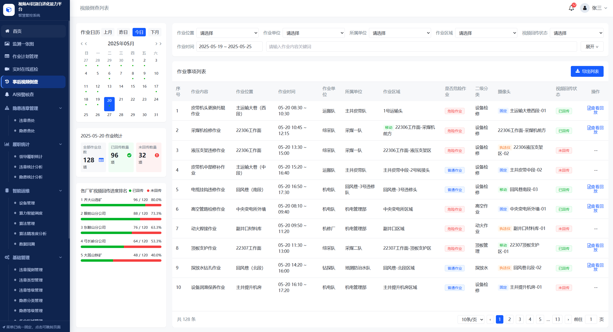
【功能说明】
1、作业日历
默认今日：快速定位并选中当天。
上月：切换至上一个自然月
昨日：快速定位并选中昨天
下月：切换至下一个自然月
日期绿点：表示该日期存在作业记录。日期蓝色选中态：表示当前正在查询的日期。
2、作业统计
全部作业总数：统计当前日历时间条件下的作业事项总数
已回传数量：统计已完成视频回传的作业数量。
未回传数量：统计尚未完成视频回传的作业数量
3、各厂矿视频回传进度排名
排名规则：按视频回传完成数量从高到低排序
已回传/总数：显示该单位已回传作业数与作业总数
回传完成率：已回传数量除以作业总数，以百分比展示
绿色进度：表示已经完成视频回传的比例
红色进度：表示尚未完成视频回传的比例
4、作业事项列表
数据权限；按照日历选择的时间进行时间联动。
列表数据:最多3行显示.
摄像头：一个摄像头一行，做多显示3行，超过则第3行显示更多(n),点击更多，则tip显示全部摄像头。
操作:针对已回传的状态的,则显示查看回放按钮.
点击查看回放,则进入视频倒查页面,如下图:
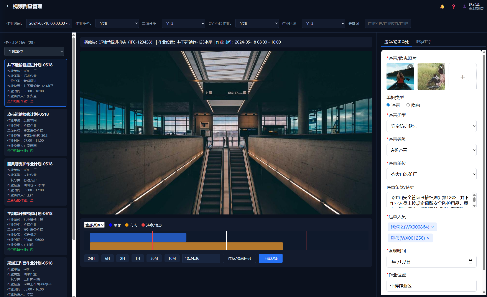
->筛选条件:作业时间,默认当天.
->作业计划列表:
①所属单位：登陆账号是：监管单位或有下级的业务单位时，则默认选择组织架构树中的第一个业务单位，可切换下级其他业务单位。若登录账号就是最末级业务单位，则显示自己所在单位，不可选择其他单位。
②默认排序:按照是危险作业优先排序>作业结束时间倒序;仅已回传或部分回传视频作业的列表;
③默认选中第一个作业:内容区域,显示当前作业关联的摄像头的视频.（未回传不可选中）
④默认不播放。点击视频后，则开始播放，支持快进，快退；播放时间周期则是作业周期时间。
⑤进度条下方增加橙色横条。当有人的时间周期内，则该周期播放进度条下方增加橙色横条。多段识别到人，则显示多端橙色横条。
⑥当点击违章标记/隐患标记时，则当前祯有一个红色竖线，表示标记点。
>可点击标注违章/隐患操作
点击后，则当前画面的直接拍照，回显在右侧的违章/隐患查处tab的照片区域。最多3张。也支持手动从电脑中选择照片。
>点击下载视频，则弹出下载视频弹窗
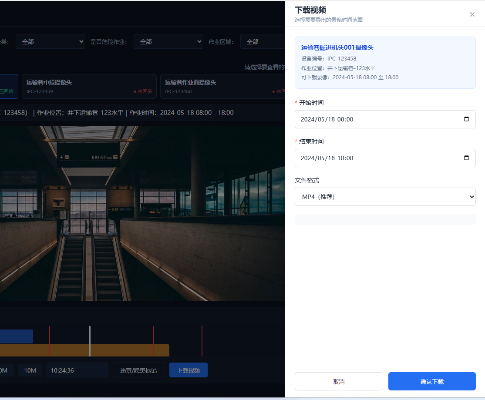
->点击全屏放大，则全屏显示。
->违章/隐患查处tab下的必要字段说明：
   单据类型违章时：
   违章名称：下拉选择，值来自于【违章规则】；
   违章等级：根据违章名称自动回显；
   违章单位：当前违章作业单位，
   违章条款/依据：根据违章名称自动回显；
   违章人员：根据AI人脸识别，自动识别人员，并回显在这里。若识别不到，则手动选择。
   
   发现时间：点击标注违章/隐患的时间；
   作业位置：作业位置的值回显。
   单据类型隐患时：
   隐患描述：输入框，默认无值。支持400字符。
   隐患分类和隐患等级：来自基础管理的对应的字典值。
   ->我标注的：tab下的必要字段说明：
   表示我当前针对这个摄像头，这个作业期间我标注的违章/隐患信息。
   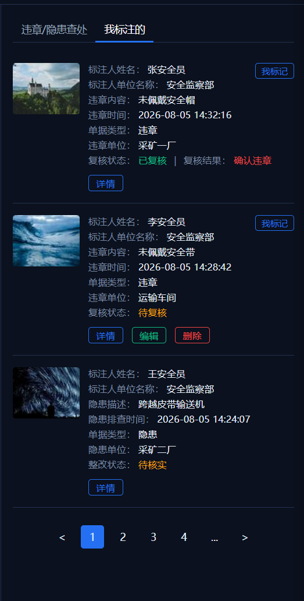

第四部分：AI视频核查
【功能页面】
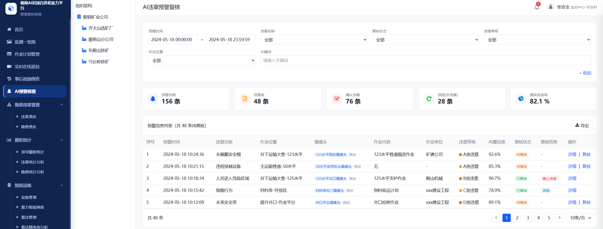
【功能说明】
数据来源：实时监控中AI预警的、视频回传过来后（包括自动回传和手动上传的视频）（需要去重）。视频回传目的：在实时监控的漏查和离线情况下，手动上传的视频的补查的情况。
1、数据流说明：所有通过AI自动预警为违章类的（不算人工，只算AI自动预警为违章类的），则（先经过AI大模型复审，通过后）进入该页面进行人工复核。自动识别到的隐患，则（先经过AI大模型复审，通过后）进入到隐患查处进行核实审核。
2、统计卡：
预警总数：统计当前查询范围内AI算法产生的全部违章预警数量。
待复核：统计尚未经过人工确认复核的AI预警数量。
确认违章：统计经人工复核后确认为真实违章的预警数量。
误报（非违章）：统计经人工判断不属于违章的AI预警数量。
复核完成率：(确认违章数量 + 误报数量) ÷ 预警总数 × 100%。
3、核心字段说明：
①复核过后，则列表数据更新为复核过后编辑更新后的数据。
②AI置信度：表示算法认为该事件属于目标违章类型的可信程度。数据来自于“算法精准度”依据各个单位，不同算法名称的精准度的值。初始化则由算法训练平台提供，算法精准度不断的提升的值，也来自于算法训练平台。
③操作：
->详情：点击详情中核心字段：预警视频。则是系统自动根据预警截图帧取值前2.5和后2.5分钟，自动截取的短视频，点击播放弹窗，支持下载视频。
->复核：点击复核，如下图：
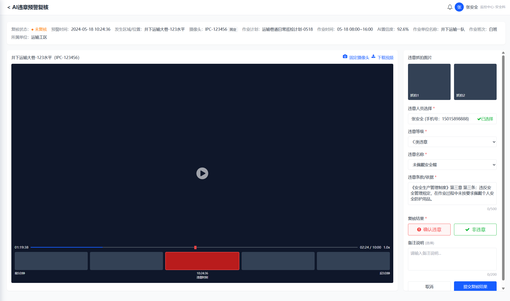
核心字段说明：
照片：则是AI识别照片的第一张和后面一张照片
违章人员：根据自动人脸识别的人员。若识别不到则需手动选择；
违章名称/等级/条款依据：则根据预警名称自动获取，支持编辑
复核结果：需要手动选择；

第五部分：违章查处
【功能页面】
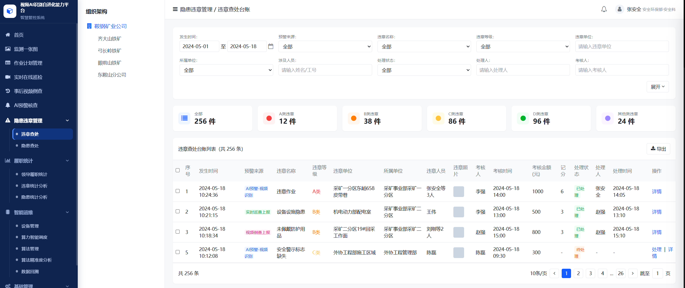
【功能说明】
数据来源：实时监控中AI预警的、视频回传过来后（包括自动回传和手动上传的视频）（需要去重）。视频回传目的：在实时监控的漏查和离线情况下，手动上传的视频的补查的情况。
1、若是AI预警类的，通过从AI预警核查过来的，则详情页面有复核结果的记录。人工标注的，则无复核结果记录。处理完成后，则有处理记录。
2、预警来源说明：AI预警-视频识别：从AI预警核查过来的数据。实时巡查上报：从实时在线巡检人员标注过来的数据。视频倒查上报：通过事后视频倒查人员标注过来的数据。
3、详情页面中的预警视频，预警截图该帧所在关键帧前后各2.5分钟，共计5分钟的短视频。点击播放在放大弹窗播放，支持下载。

第六部分：隐患查处
【功能页面】
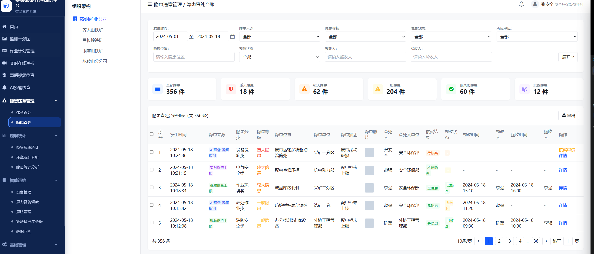
【功能说明】
->数据来源：实时监控中AI预警的、视频回传过来后（包括自动回传和手动上传的视频）（需要去重）。视频回传目的：在实时监控的漏查和离线情况下，手动上传的视频的补查的情况。
核心字段说明：
①隐患来源：
->AI预警-视频识别：通过AI自动识别（包括实时监控和回传后识别），AI大模型复核后的隐患。
->实时巡查上报：实时在线巡检，手动标注的。
->视频倒查上报：事后视频倒查，手动标注的。
②核实审核：
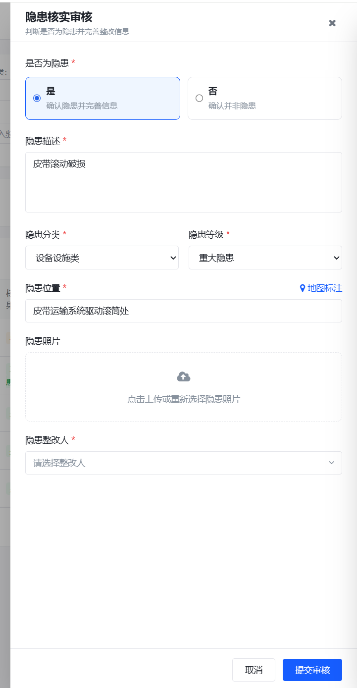
信息回显过来，可支持进行编辑，编辑后则更新列表中的数据为编辑后的数据。并下发至隐患排查治理。状态和整改记录等同步该列表进行同步更新和查看。

第七部分：基础管理
->隐患分类和隐患等级：针对鞍钢项目是从隐患排查治理中同步过来，隐藏该菜单。非安全生产系统的，则需单独配置。
->作业区域管理：
1、每个单位可独立设置作业区域，用于在实时在线巡检的摄像头的层级架构使用和设备管理关联作业区域选择。
2、支持一级和二级区域：同步电子档案的信息。也可支持手动新增非电子档案的区域，无电子档案则无法同监测一张图联动，其他业务无影响，牵涉到标注点位的则隐藏处理标注入口。
3、每个二级区域都有风险等级。风险等级为较大和重大的所关联的摄像头，就是对应【实时在线巡检-自定义轮播设置中的高风险区域】的规则。
4、针对区域划分：
①针对一级作业区域，则可选择一整栋或多各楼层或者某个楼层的多个片区。作为整个一级区域。
②二级作业区域，则在一级作业区域选择的楼栋，楼层，获取片区中进行选择，不可超过一级区域选择的范围，可多选，选择后，作为二级区域的范围。
③关联摄像头：是设备管理，关联摄像头后，回显过来的数据。
④挂载了摄像头的区域不可删除，toast提示“该区域已挂载摄像头，请取消关联后，再进行操作删除”。
->人脸采集库：
①针对鞍钢项目则从相关方采集数据而来。针对无采集源数据，则显示右上角的“手机采集”按钮，进行采集信息。
②采集信息，当输入手机号码或身份证号码时，比对【系统管理-成员管理】是否已经存在，存在则回显基础信息，录入采集人脸并调取采集接口。比对不存在，toast提示“当前人员不存在，请联系管理员录入人员基本信息”。其中黑名单是根据相关方人员是否在黑名单的属性，若无相关方管理系统，则无该属性。
  

第八部分：数据回溯
【功能页面】
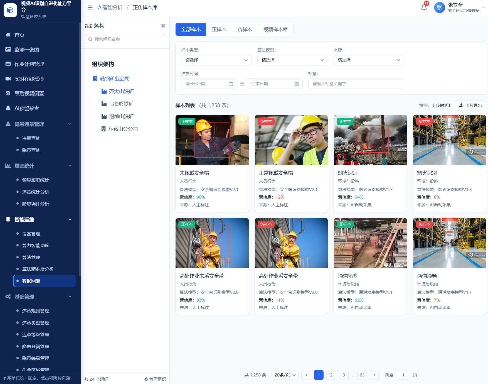
【功能说明】
仅说明核心功能：
数据权限：组织架构根据数据来源单位相关。样本来源于某个单位，则经过AI训练标注中心后，则也归属某个单位。
无论是图片还是视频样本，则点击后，直接弹窗预览和播放窗口播放。

第九部分：首页
【功能页面】
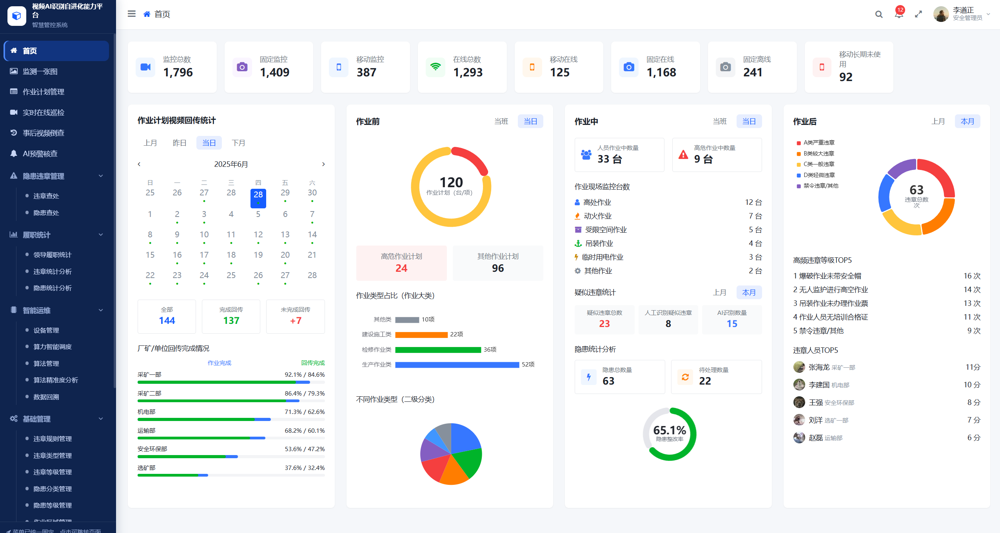
【功能说明】
首页按照“设备资源、作业前、作业中、作业后”四个维度展示当前账号数据权限范围内的综合运行态势。集团账号统计本级及全部下级单位；业务单位账号统计本级及下级单位；所有指标均可按照所属单位字段进行权限过滤。

1、监控设备统计
①监控总数：统计固定监控和移动监控设备总数。
②固定监控：统计固定安装摄像头数量。
③移动监控：统计移动摄像头、移动布控球、执法记录仪等移动设备数量。
④在线总数：统计当前能够正常返回心跳或视频流的设备数量，等于固定在线与移动在线数量之和。
⑤移动在线、固定在线：分别统计在线的移动设备和固定摄像头数量。
⑥固定离线：统计超过设备心跳超时时间、无法正常连接的固定摄像头数量。
⑦移动长期未使用：统计超过规定周期未上线、未使用或未上传视频的移动设备数量，长期未使用周期支持后台配置。
⑧点击设备统计卡片，可跳转至设备管理列表并自动带入对应的设备类型和状态筛选条件。

2、作业计划视频回传统计
①支持上月、昨日、当日、下月和日历日期快捷选择，默认查询当日数据；日历中的状态点表示该日期存在作业计划或回传数据。
②全部：统计选定日期内全部作业计划数量。
③完成回传：统计已成功关联固定摄像头录像，或已完成移动设备视频上传的作业数量。
④未完成回传：统计作业周期已结束但尚未取得对应视频的作业数量。全部数量应等于完成回传与未完成回传数量之和。
⑤厂矿/单位回传完成情况：按照所属单位统计作业完成率和视频回传完成率。作业完成率＝已完成作业数÷计划作业总数×100%；回传完成率＝已完成视频回传作业数÷应回传作业数×100%。
⑥点击单位名称或进度条，可进入作业计划列表查看该单位的作业及未回传明细。

3、作业前
①支持当班、当日两个统计维度。
②作业计划：统计当前时间范围内计划作业总数，并展示涉及单位数量。
③高危作业计划：统计“是否危险作业”为“是”的作业计划数量；其他作业计划统计非危险作业数量。
④作业类型占比（作业大类）：按照生产作业、检修作业、建设施工作业和其他作业等一级分类统计作业数量。
⑤不同作业类型（二级分类）：按照作业类型的二级分类展示数量及占比，鼠标移入图表显示分类名称、数量和占比。

4、作业中
①人员作业中数量：统计当前处于作业周期内且涉及现场人员的作业数量，单位为“项”。
②高危作业中数量：统计当前正在进行的危险作业数量，单位为“项”。
③作业现场监控台数：按照高处作业、动火作业、受限空间作业、吊装作业、临时用电作业和其他作业，统计当前参与作业监控的摄像头数量。
④疑似违章总数：统计当前周期内尚未完成定性的疑似违章事件数量；人工识别疑似违章统计实时巡检或视频倒查人工标注的数据；AI识别数量统计AI算法自动识别的数据。相同事件按照平台排重规则只统计一次。
⑤隐患总数量：统计核实成立的隐患事件总数；待处理数量统计尚未完成核实、整改或审核的隐患数量。
⑥隐患整改率＝已整改并审核通过数量÷应整改隐患总数×100%。点击指标可进入隐患查处列表并带入相应状态。

5、作业后
①支持上月、本月统计维度。
②违章等级分布：按照A类严重违章、B类较大违章、C类一般违章、D类轻微违章、禁令违章/其他展示数量及占比；违章总数为各等级数量之和。
③高频违章TOP5：按照确认成立的违章发生次数从高到低排序，展示违章名称和发生次数。
④违章人员TOP5：按照人员累计违章考核分值从高到低排序，展示头像、姓名、所属单位和分值。
⑤违章统计以复核确认成立为口径，隐患统计以核实审核通过为口径；AI重复识别、跨摄像头识别和大模型复核数据均按照统一事件ID排重。

第十部分：领导履职统计
【功能页面】
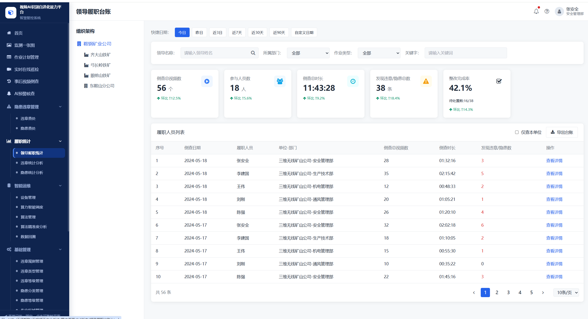
【功能说明】
用于统计领导及管理人员通过事后视频倒查开展安全履职的情况，形成履职人员、倒查视频、发现问题和整改完成情况的可追溯台账。

1、数据权限
①组织架构默认定位当前登录账号所属单位，展示本级及下级单位；选择组织节点后，查询该单位及下级单位的履职数据。
②“仅查本单位”开启时，只查询当前选中单位自身数据，不包含下级单位。

2、查询条件
①快捷日期：支持今日、昨日、近3日、近7天、近30天、近90天和自定义日期，按照倒查日期筛选。
②领导名称：按照履职人员姓名进行模糊查询。
③所属部门：筛选履职人员所在部门。
④作业类型：按照倒查视频所关联作业的类型筛选。
⑤关键字：支持按照人员姓名、单位、部门或关联作业内容进行综合搜索。

3、统计卡片
①倒查总视频数：统计查询范围内完成查看或形成履职记录的视频数量。
②参与人员数：统计开展视频倒查的去重人员数量。
③倒查总时长：累计统计所有履职人员的视频实际查看时长。
④发现违章/隐患总数：统计履职倒查过程中人工标注并提交的违章和隐患事件总量。
⑤我标记违章数：统计当前登录账号在倒查过程中标记的违章事件数量。
⑥整改完成率＝已完成处置或整改的问题数量÷发现违章/隐患总数×100%；同时展示待处置数量。
⑦环比数据按照当前查询周期与上一等长周期进行比较。

4、履职人员列表
①序号：当前分页中的数据顺序。
②倒查日期：该次履职倒查发生的日期。
③履职人员：开展视频倒查的人员姓名。
④单位-部门：履职人员所属单位及部门。
⑤倒查方式：包括按摄像头、按作业计划等倒查入口。
⑥视频数：该次履职过程中查看的视频数量。
⑦倒查时长：该次履职实际播放和查看视频的累计时长。
⑧发现违章/隐患数：该次倒查标注并提交的问题数量。
⑨查看详情：进入履职台账详情，查看倒查视频、发现的违章/隐患、违章查处及隐患查处记录。
⑩导出台账：按照当前组织和查询条件导出履职统计明细。

5、统计规则
①同一人员在同一时间范围内重复打开同一视频时，应按照有效播放记录累计时长，拖动进度条或暂停时间不计入有效倒查时长。
②只有完成提交的违章或隐患标注才计入发现问题数量，草稿和已撤销记录不计入。
③问题处理状态与违章查处、隐患查处结果保持同步更新。

第十一部分：违章统计分析
【功能页面】
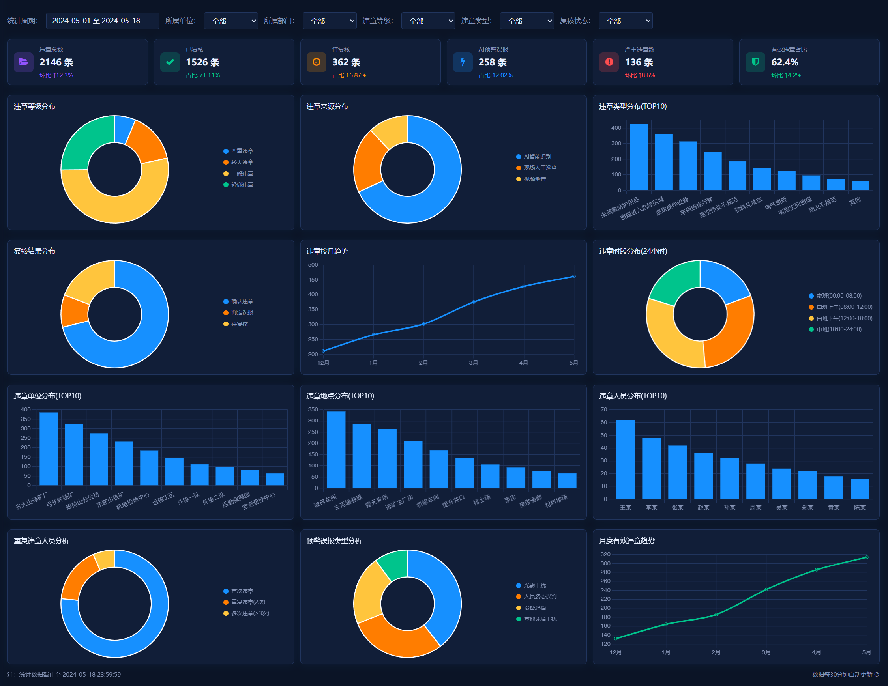
【功能说明】
用于从违章数量、等级、来源、类型、单位、地点、人员、复核结果及时间趋势等维度分析违章事件，为高频问题治理和人员考核提供依据。统计数据默认每30分钟自动更新。

1、查询条件
①统计周期：支持选择日期或日期范围，所有统计卡片和图表按照违章发生时间查询。
②所属单位：按照违章数据的所属单位筛选，并受当前账号组织数据权限控制。
③所属部门：筛选违章人员或违章单位所属部门。
④违章等级：按照A、B、C、D及其他等级筛选。
⑤违章类型：按照违章规则所属类型筛选。
⑥复核状态：按照待复核、已复核、确认违章、误报等状态筛选。

2、统计卡片
①违章总数：统计查询范围内产生的违章预警及人工上报事件总数。
②已复核：统计已完成人工复核的数据数量及占违章总数比例。
③待复核：统计尚未完成人工复核的数据数量及占比。
④AI预警误报：统计AI预警经复核确认为非违章的数据数量及占比。
⑤严重违章数：统计达到严重等级标准的违章事件数量。
⑥有效违章占比＝复核确认违章数量÷进入复核范围的违章总数×100%。
⑦环比按照当前统计周期与上一等长周期计算增长或下降比例。

3、分布分析
①违章等级分布：展示不同违章等级的数量及占比。
②违章来源分布：按照AI预警-视频识别、实时巡查上报、视频倒查上报等来源统计。
③违章类型分布TOP10：展示发生数量最高的十类违章。
④复核结果分布：展示确认违章、误报和待复核的数量关系。
⑤违章单位分布TOP10：按照违章单位统计发生数量并排序。
⑥违章地点分布TOP10：按照作业位置或作业区域统计高发地点。
⑦违章人员分布TOP10：按照人员统计违章次数或累计考核分值。

4、趋势与专项分析
①违章按月趋势：按月展示违章事件数量变化。
②违章时段分布（24小时）：按照违章发生小时统计高发时间段。
③重复违章人员分析：统计同一人员在查询周期内重复发生违章的次数及涉及类型。
④预警误报类型分析：按照算法或违章类型统计AI误报数量，为算法优化提供数据依据。
⑤月度有效违章趋势：按月展示复核确认的有效违章数量或有效违章占比变化。

5、统计口径
①AI识别事件应先经过排重和复核；相同作业周期、相同人员、相同事件类型的重复信号只统计一个事件。
②确认违章和误报均以最新复核结果为准；复核结论变更后，相关统计同步更新。
③点击图表分类或排名项，可进入违章查处台账并自动带入当前统计周期和对应筛选条件。

第十二部分：隐患统计分析
【功能页面】
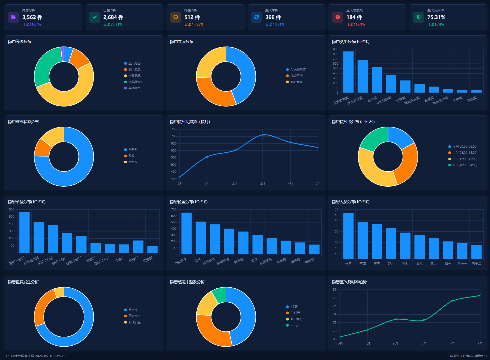
【功能说明】
用于从隐患等级、来源、类型、整改状态、单位、位置、人员和时间趋势等维度分析隐患发现及治理情况，重点监控重大隐患、重复隐患和超期未整改问题。统计数据默认每30分钟自动更新。

1、查询条件
①统计周期：支持选择日期或日期范围，按照隐患发现时间查询。
②所属单位：按照隐患所属单位筛选，并受当前账号组织数据权限控制。
③所属部门：筛选隐患责任部门或发现人员所属部门。
④隐患等级：按照重大、较大、一般、低风险等等级筛选。
⑤隐患类型：按照隐患分类字典筛选。
⑥整改状态：按照待整改、整改中、已整改、已关闭、超期等状态筛选。

2、统计卡片
①隐患总数：统计查询范围内核实审核通过的隐患事件总数。
②已整改数：统计已完成整改并审核通过的隐患数量及占比。
③待整改数：统计已确认但尚未开始整改的隐患数量及占比。
④整改中数：统计已进入整改流程但尚未完成审核的隐患数量及占比。
⑤重大隐患数：统计隐患等级为重大的事件数量。
⑥整改完成率＝已完成整改并审核通过数量÷应整改隐患总数×100%。
⑦环比按照当前统计周期与上一等长周期计算。

3、分布分析
①隐患等级分布：展示各隐患等级的数量及占比。
②隐患来源分布：按照AI预警-视频识别、实时巡查上报、视频倒查上报、人工上报等来源统计。
③隐患类型分布TOP10：展示发生数量最高的十类隐患。
④隐患整改状态分布：展示待整改、整改中、已整改和超期等状态数量。
⑤隐患单位分布TOP10：按照隐患责任单位统计并排序。
⑥隐患位置分布TOP10：按照作业区域或隐患位置统计高发地点。
⑦隐患人员分布TOP10：按照发现人员、责任人员或关联作业人员统计，具体统计口径应在图表标题或提示中说明。

4、趋势与专项分析
①隐患按时间趋势（按月）：按月展示隐患发现数量变化。
②隐患按时段分布（24小时）：按照隐患发现小时统计高发时段。
③隐患重复发生分析：统计同一单位、同一位置或同一类型反复发生的隐患。
④隐患超期未整改分析：统计超过整改期限仍未完成的隐患，并展示超期时长和责任单位。
⑤隐患整改及时率趋势：按月展示在要求期限内完成整改的隐患比例。

5、统计口径
①AI识别隐患经AI大模型自动复核后进入隐患核实审核；只有核实审核通过的数据计入有效隐患统计。
②同一作业周期内相同区域、相同隐患类型的重复识别信号按照事件排重规则合并。
③隐患整改状态和整改结果从隐患排查治理系统同步更新；状态变化后相关统计同步刷新。
④点击图表分类、排名项或统计卡片，可进入隐患查处台账并自动带入当前统计周期及对应筛选条件。

第十三部分：监测一张图
【功能页面】
集团版：
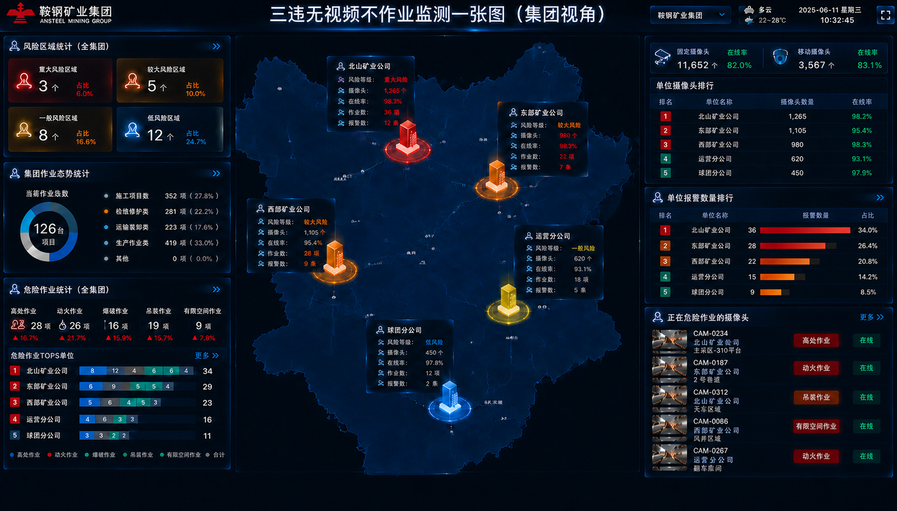

厂矿级：
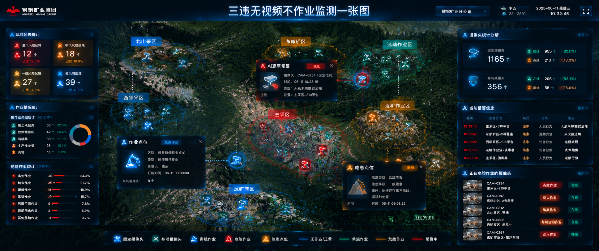

作业区域详情弹窗：
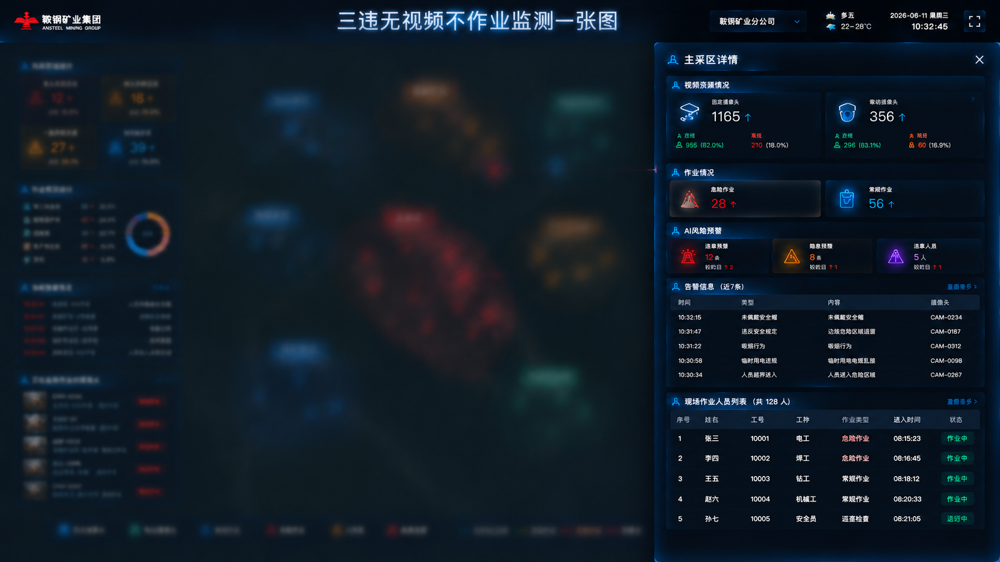

【功能说明】
监测一张图用于将集团、厂矿、作业区域、摄像头、作业计划、AI预警和隐患数据叠加到GIS地图或电子档案底图上，形成集团级总览、厂矿级监控和作业区域详情三级联动视图。页面按照登录账号的数据权限确定默认视角，支持单位切换、地图点位交互和全屏展示。

1、数据权限与视角切换
①集团账号默认进入集团视角，展示集团本级及有权限查看的下属厂矿、分公司和业务单位；业务单位账号默认进入所属厂矿级视角。
②顶部单位选择器用于切换当前查看单位。集团视角选择某个厂矿后进入对应厂矿级地图；厂矿级页面切换单位后重新加载该单位的区域、摄像头、作业和预警数据。
③集团视角只展示单位汇总数据，不直接展示人员明细；厂矿级视角展示本单位作业区域、摄像头和实时事件；点击作业区域后展示区域详情。
④所有指标按照当前选中单位及其下级单位进行统计，末级单位仅展示本单位数据。

2、顶部公共区域
①页面标题：展示“三违无视频不作业监测一张图”及当前视角，集团版显示“集团视角”，厂矿级显示当前厂矿名称。
②单位选择：切换集团、厂矿或分公司，切换后地图、统计卡片和列表同步刷新。
③天气信息：展示当前单位所在地天气和温度，为室外作业提供环境参考。
④日期时间：展示系统当前日期、星期和时间，时间按秒刷新。
⑤全屏：进入或退出大屏全屏模式，适用于调度中心和监控大屏展示。

3、集团版地图与统计
①风险区域统计（全集团）：按照重大风险、较大风险、一般风险、低风险统计作业区域数量和占比。风险等级来自作业区域管理配置。
②集团作业态势统计：统计当前作业总数，并按照施工作业、检维修作业、运输装卸、生产作业和其他作业展示数量及占比。
③危险作业统计（全集团）：按照高处作业、动火作业、爆破作业、吊装作业、有限空间作业等危险作业类型统计数量及变化趋势。
④危险作业TOP5单位：按照当前危险作业数量对单位排序，并通过颜色区分不同危险作业类型。点击单位可进入相应厂矿视角。
⑤集团GIS地图：在集团地图上展示各下属单位的地理位置和综合风险状态。点位颜色按照当前单位最高风险等级显示：红色表示重大风险，橙色表示较大风险，黄色表示一般风险，蓝色表示低风险。
⑥单位悬浮信息：鼠标移入或点击单位点位，展示单位名称、风险等级、摄像头数量、在线率、当前作业数和报警数。
⑦固定摄像头、移动摄像头：分别统计集团范围内设备总量、在线数量或在线率。
⑧单位摄像头排行：按照摄像头数量对单位排序，同时展示设备在线率。
⑨单位报警数量排行：按照当前统计周期内的报警数量对单位排序，并展示报警占比。
⑩正在危险作业的摄像头：展示正在执行危险作业且在线的摄像头列表，包括摄像头编号、所属单位、区域、危险作业类型和在线状态。点击列表项进入相应厂矿视角，并定位该摄像头。

4、厂矿级地图与统计
①风险区域统计：按照当前厂矿内重大、较大、一般和低风险区域统计数量及占比。
②作业情况统计：按照作业大类统计当前正在进行的作业数量及占比。
③危险作业统计：按照危险作业类型统计当前作业数量和占比。
④厂矿电子地图：加载当前单位的电子档案、GIS地图或影像底图，并显示作业区域边界、区域名称、摄像头点位、作业点位和隐患点位。
⑤区域边界：不同作业区域使用不同颜色轮廓区分；区域颜色根据风险等级或业务状态展示。点击区域打开作业区域详情弹窗。
⑥摄像头点位：区分固定摄像头和移动摄像头；在线设备高亮显示，离线设备置灰。点击摄像头进入实时监控或打开视频预览。
⑦作业点位：展示正在进行的常规作业和危险作业。常规作业使用蓝色，危险作业使用红色或橙色；点击后展示作业名称、作业类型、负责人、开始时间和关联摄像头数量。
⑧AI违章预警：在预警发生位置显示红色告警点位，点击后展示摄像头、时间、预警类型、作业位置等信息，并可进入AI预警核查或违章查处。
⑨隐患点位：在隐患发生位置显示橙色点位，点击后展示隐患类型、隐患等级、描述和发现时间，并可进入隐患查处。
⑩摄像头统计分析：分别展示固定摄像头、移动摄像头的设备总数、在线数量、离线数量和在线率。
⑪当前报警信息：按照时间倒序展示当前单位最新的违章和隐患报警，包括时间、位置、类型、分类及内容。点击报警可在地图中定位对应点位。
⑫正在危险作业的摄像头：展示当前关联危险作业的在线摄像头，点击可联动地图定位和视频预览。

5、作业区域详情弹窗
①区域名称：弹窗标题显示当前选中的一级或二级作业区域名称。
②视频资源情况：统计区域内固定摄像头和移动摄像头数量，并分别展示在线数量、离线数量及在线率。点击摄像头统计卡片可查看该区域摄像头列表。
③作业情况：展示区域内正在进行的危险作业和常规作业数量；点击数量可查看当前区域作业计划明细。
④AI风险预警：展示区域内违章预警、隐患预警和涉及人员数量，并显示相较昨日的变化。违章预警以复核确认或待复核数据为统计范围，隐患预警以AI大模型复核后进入核实审核的数据为统计范围。
⑤告警信息（近7条）：按照发生时间倒序展示最近告警，字段包括时间、类型、内容和摄像头编号；点击“查看更多”进入相应预警或查处列表，并带入当前区域筛选条件。
⑥现场作业人员列表：展示当前区域内正在作业的人员，字段包括序号、姓名、工号、工种、作业类型、进入时间和状态。
⑦人员来源：人员数据来自作业计划人员、门禁/定位系统或人脸识别结果；同一人员在同一区域的多次识别应进行排重。
⑧作业状态：作业中的人员显示“作业中”；巡检、通行等非作业状态按照实际业务状态展示。
⑨关闭弹窗：点击右上角关闭按钮后返回当前地图位置，不清空单位、地图层级及筛选状态。

6、地图图例与状态规则
①固定摄像头、移动摄像头使用不同图标表示；在线状态使用高亮色，离线状态置灰。
②常规作业、危险作业、隐患点位、预警中使用独立颜色和图标，并在页面底部图例中统一说明。
③无作业/正常：表示摄像头当前未关联进行中的作业，且没有持续预警。
④预警中：表示摄像头或区域存在尚未结束的AI违章/隐患预警；预警结束或完成处理后恢复对应作业状态。
⑤地图聚合：地图缩放层级较小时，相邻点位应聚合显示数量；放大后自动展开为具体摄像头、作业或事件点位。

7、数据刷新与联动规则
①摄像头在线状态、AI预警和当前报警信息采用实时或准实时刷新；作业计划、人员和隐患整改状态按业务数据变化同步更新。
②切换单位、点击区域、摄像头、作业点位或报警信息时，地图与右侧统计列表保持联动。
③从地图进入实时监控时，自动定位并选中对应摄像头；进入作业计划时自动带入对应作业；进入预警或查处页面时自动带入事件ID、单位和区域条件。
④同一事件在多个摄像头或多个算法中重复识别时，按照平台事件排重规则合并后再计入报警和统计数量。
⑤没有电子档案或GIS区域数据的手工新增作业区域，不在地图上绘制区域轮廓，但不影响作业计划、摄像头关联和其他业务使用。

